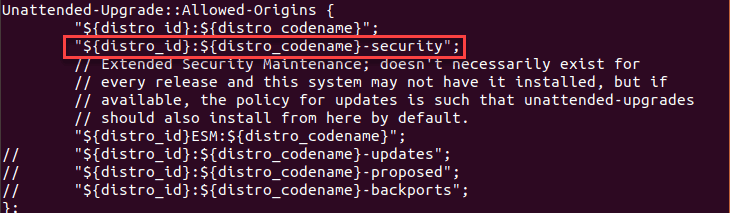

# Operating system considerations

## Choices
The DHIS2 application components can run on a range of operating systems, including Microsoft
Windows, FreeBSD (and other BSDs) as well as various flavours of linux.  Most implementers choose
to run on some distribution of linux as the performance, security and reliability of the web
proxy and database tends to be better tested on linux.

The two most popular choices in production seem to be CentOS and Ubuntu.  Docker containers tend
to be built from micro-distributions such as Alpine Linux.  All of these environments are very
widely tested and so the choice tends to be one of personal choice and experience with the particular
environment.

This guide will describe an installation running ubuntu 18.04 on the host server together with a 
number of lxc containers also running ubuntu 18.04.  We will describe the process in a step by step
manner, but all of the steps below should be implemented as a simple shell script or an ansible playbook. 

## Ubuntu 18.04 setup

The following description applies to both the host machine and all the containers.  In each case we want
to ensure:
1.  that the package installation is the minimal required
2.  the ssh access is suitably configured

### Package update
When working off a fresh OS image it is important to ensure that all packages are updated. On ubuntu. Failing to keep your Ubuntu operating system packages up-to-date risks overall security

run:
```
apt-get dist-update
apt-get dist-upgrade
```
You may wish to also setup unattended upgrades to ensure that security patches get applied 
automatically.  The tension here is between an automatic upgrade being applied which somehow
breaks the system vs a vital security patch being applied too late or never.  In general we 
recommend that unattended upgrades are configured unless you have a well functioning system for
alerting and manually updating as required.  It is also possible to *blacklist* certain packages,
eg. tomcat8 and openjdk, and thus ensure that OS upgrades are done automatically but updates to
these packages are applied manually.

In general I find that the risk of not applying unattended 

####Configuring automatic security updates
Managing update process manually wastes valuable resources and can even lead to overlooking essential security updates. This section explains how to enable automatic security updates in Ubuntu 18.04.

##### Prerequisites
1. User account with sudo or root privilleges

##### Step 1: Install Unattended upgrades package
1. Install the unattended-upgrade package by running the command below. The package is installed on latest version of Ubuntu by default

```
sudo apt install unattended-upgrades
```
2. Verify the installation:
```
systemctl status unattended-upgrades
```
The above command should show active (running) status.

##### Step 2: Step 2: Configure unattended-upgrades file
After successful installation of the package in Step 1, it is now time to configure individual elements and key parameters for the auto updates

######Accessing the configuration file
The configuration file for the Unattended updates package is found in the **/etc/apt/apt.conf.d/**. Edit the the configuration using any editor of your choice. We are using nano

```
sudo nano /etc/apt/apt.conf.d/50unattended-upgrades
```
> All lines starting with // is ignored by Unattended updates package. If you want a repository to update automatically, you need to remove the //. 

######Accepting automatic security updates
For our purposes, we only need to remove // from the “security” line.

Look for a line with security as shown below


######Prevent updates of other packages
The **Unattended-Upgrade::Package-Blacklist** section in the same configuration file will block upgrades of packages added. To block a sepecific package, add the package name in this section. Remove // from the line if any is available.
> Example: we block openjdk-8, tomcat8 as shown below. Save the configuration file and exit


### Securing ssh

### Firewall setup 

## Mail and munin-node.  